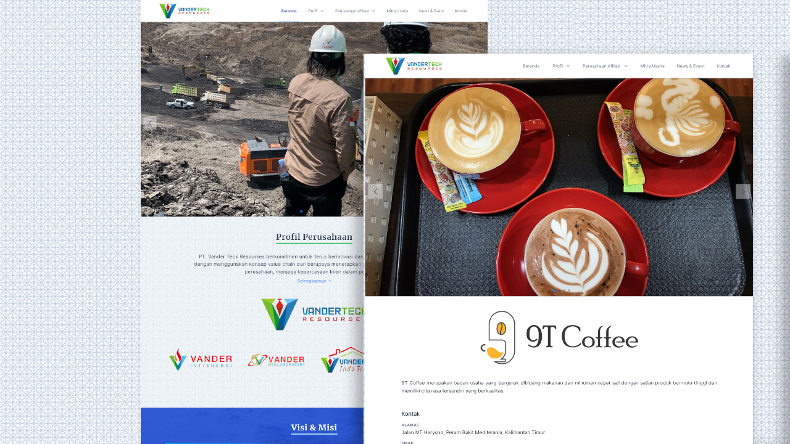

## VanderTech

#### Deskripsi

Website company profile untuk PT. Vandertech, sebuah perusahaan tambang batu bara. Website ini berfungsi sebagai media branding perusahaan dan informasi dasar bagi mitra serta calon investor.

#### Fitur

<ul>
    <li>
        Halaman Profil Perusahaan: Menampilkan informasi mengenai visi, misi, dan sejarah perusahaan.
    </li>
    <li>
        Halaman Proyek Tambang: Menampilkan daftar proyek tambang yang sedang berjalan maupun yang telah diselesaikan.
    </li>
    <li> 
        Halaman Kontak & Form Integrasi: Memfasilitasi komunikasi dengan klien atau pihak yang berminat melalui form yang terintegrasi.
    </li> 
    <li> 
        Desain Simpel & Responsif: Tampilan website yang simpel dan dapat menyesuaikan diri dengan berbagai ukuran layar sesuai preferensi klien.
    </li>
</ul>

#### Preview

